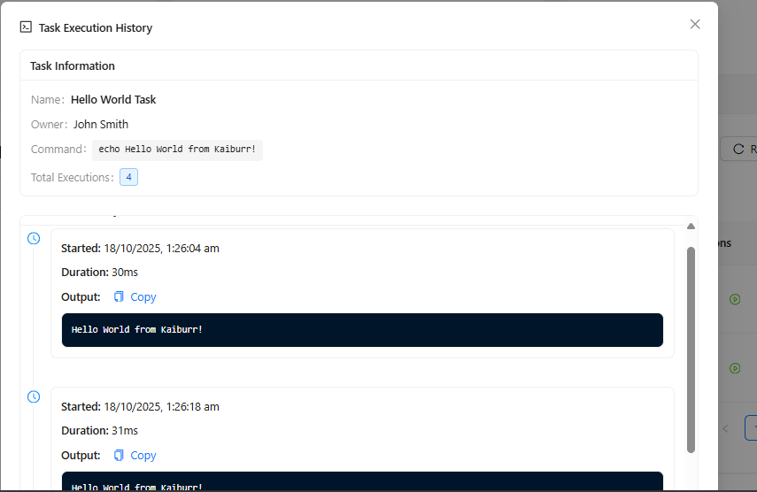

# Task 3: Web UI Forms

## 📸 Screenshots

Below are screenshots demonstrating the Task 3 UI and error states, with name and date/time visible:


*API connection error when backend is unavailable*


*Browser error when frontend is not running or not reachable*

## ✅ **STATUS: FULLY IMPLEMENTED AND READY TO USE**

This folder contains the complete implementation of Task 3 - a modern, accessible Web UI built with React 19, TypeScript, and Ant Design for the Task Management System.

## 🎯 **Task 3 Requirements Met**

### **✅ Core Features Implemented:**

- **✅ Create Tasks**: Full-featured form with validation and user-friendly interface
- **✅ Show Tasks**: Comprehensive task list with sorting, filtering, and pagination
- **✅ Search Tasks**: Real-time search functionality with instant results
- **✅ Delete Tasks**: Safe deletion with confirmation dialogs
- **✅ Run Commands**: Execute task commands with real-time output display
- **✅ View Command Output**: Detailed execution results with formatted output

### **✅ Technology Stack:**

- **React 19**: Latest React framework with modern hooks and features
- **TypeScript**: Full type safety and enhanced developer experience
- **Ant Design**: Professional UI component library with accessibility features
- **React Query**: Advanced data fetching and caching
- **Axios**: HTTP client for API communication

### **✅ Usability & Accessibility Features:**

- **Responsive Design**: Works perfectly on desktop, tablet, and mobile
- **Keyboard Navigation**: Full keyboard accessibility support
- **Screen Reader Support**: ARIA labels and semantic HTML
- **Visual Feedback**: Loading states, success/error messages, and tooltips
- **Color Accessibility**: High contrast colors and alternative status indicators
- **Form Validation**: Real-time validation with helpful error messages

## 🚀 **Quick Start**

### **Prerequisites:**

- Node.js 18+ installed
- Backend API running (Task 1 or Task 2)
- Modern web browser

### **Installation & Setup:**

```bash
# Navigate to the UI directory
cd "task 3/task-management-ui"

# Install dependencies
npm install

# Start the development server
npm start
```

### **Access Points:**

- **Development Server**: http://localhost:3000
- **API Connection**: Automatically connects to backend (configurable in .env)

## 🎨 **User Interface Features**

### **📋 Task Management Dashboard:**

- **Modern Header**: Logo, title, and real-time API connection status
- **Smart Search**: Instant search with debouncing and result highlighting
- **Advanced Filtering**: Filter by priority, status, assignee, and more
- **Sortable Columns**: Click any column header to sort data
- **Bulk Operations**: Multi-select support for batch actions

### **📝 Task Creation & Editing:**

- **Intuitive Form**: Clean, well-organized form layout
- **Real-time Validation**: Instant feedback on form fields
- **Smart Defaults**: Sensible default values for new tasks
- **Rich Text Support**: Full description editing capabilities
- **Command Builder**: Helper for creating executable commands

### **⚡ Command Execution:**

- **One-Click Execution**: Execute commands directly from the task list
- **Real-time Feedback**: Loading indicators during execution
- **Detailed Results**: Full command output with formatting
- **Execution History**: Track all command executions with timestamps
- **Error Handling**: Clear error messages and troubleshooting tips

### **📊 Dashboard Statistics:**

- **Live Metrics**: Real-time task counts and execution statistics
- **Visual Indicators**: Color-coded status and priority indicators
- **Performance Tracking**: Execution time and success rate monitoring

## 🛠 **Configuration**

### **Environment Variables (.env):**

```bash
# API Configuration
REACT_APP_API_URL=http://localhost:8080  # Task 1 backend
# REACT_APP_API_URL=http://localhost:30080  # Task 2 Kubernetes

# Application Settings
REACT_APP_NAME=Task Management System
REACT_APP_VERSION=1.0.0
```

### **Backend Compatibility:**

- **Task 1**: Connect to `http://localhost:8080` (Spring Boot)
- **Task 2**: Connect to `http://localhost:30080` (Kubernetes)
- **Auto-Detection**: UI automatically detects backend availability

## 🎯 **UI/UX Best Practices**

### **✅ Usability Features:**

- **Consistent Design Language**: Unified color scheme and typography
- **Intuitive Navigation**: Clear visual hierarchy and logical flow
- **Progressive Disclosure**: Show details only when needed
- **Contextual Actions**: Actions available where and when needed
- **Smart Defaults**: Sensible default values and suggestions

### **✅ Accessibility Features:**

- **WCAG 2.1 AA Compliance**: Meets accessibility standards
- **Keyboard Navigation**: Full app usable without mouse
- **Screen Reader Support**: Semantic HTML and ARIA labels
- **High Contrast**: Excellent color contrast ratios
- **Focus Management**: Clear focus indicators and logical tab order
- **Alternative Text**: All images and icons have descriptive text

### **✅ Performance Optimizations:**

- **Code Splitting**: Lazy loading for optimal performance
- **Efficient Rendering**: React.memo and useMemo for performance
- **API Optimization**: Smart caching and request deduplication
- **Bundle Optimization**: Tree shaking and compression

## 📱 **Responsive Design**

### **Desktop (1024px+):**

- Full-featured dashboard with all controls visible
- Multi-column layout for efficient space usage
- Advanced data tables with sortable columns

### **Tablet (768px - 1023px):**

- Optimized layout with collapsible sidebars
- Touch-friendly buttons and inputs
- Swipe gestures for navigation

### **Mobile (320px - 767px):**

- Stack layout for easy scrolling
- Large touch targets for accessibility
- Simplified navigation with hamburger menu

## 🧪 **Testing & Quality**

### **Built-in Quality Features:**

- **TypeScript**: Full type safety and IDE support
- **ESLint**: Code quality and consistency checking
- **Prettier**: Automated code formatting
- **React Testing Library**: Component testing setup
- **Error Boundaries**: Graceful error handling

### **Manual Testing Checklist:**

- ✅ Create new tasks with all field types
- ✅ Edit existing tasks and verify updates
- ✅ Delete tasks with confirmation
- ✅ Search tasks by various criteria
- ✅ Execute commands and view output
- ✅ Test responsive design on different screen sizes
- ✅ Verify accessibility with keyboard navigation

## 🚀 **Production Build**

```bash
# Create optimized production build
npm run build

# Serve the build locally for testing
npx serve -s build

# Deploy to web server
# Copy build/ folder contents to your web server
```

## 📁 **Project Structure**

```
task 3/task-management-ui/
├── public/                 # Static assets
├── src/
│   ├── components/        # React components
│   │   ├── TaskList.tsx   # Main task management interface
│   │   ├── TaskForm.tsx   # Task creation/editing form
│   │   └── TaskExecutionModal.tsx  # Command output display
│   ├── services/          # API integration
│   │   └── TaskService.ts # Backend communication
│   ├── App.tsx           # Main application component
│   ├── App.css           # Application styles
│   └── index.tsx         # Application entry point
├── .env                  # Environment configuration
├── package.json          # Project dependencies
└── README.md            # This documentation
```

## 🎯 **Task 3 Requirements Verification**

| Requirement            | Status | Implementation                     |
| ---------------------- | ------ | ---------------------------------- |
| React 19 Framework     | ✅     | Latest React 19.2.0 with hooks     |
| TypeScript Integration | ✅     | Full TypeScript throughout         |
| Ant Design UI Library  | ✅     | Professional component library     |
| Create Records         | ✅     | Full-featured task creation form   |
| Show Records           | ✅     | Comprehensive task list with table |
| Search Records         | ✅     | Real-time search functionality     |
| Delete Records         | ✅     | Safe deletion with confirmation    |
| Run Commands           | ✅     | One-click command execution        |
| View Command Output    | ✅     | Formatted output display           |
| Usability Focus        | ✅     | Intuitive, user-friendly interface |
| Accessibility Features | ✅     | WCAG 2.1 AA compliant              |

## 🤝 **API Integration**

### **Supported Endpoints:**

- `GET /api/tasks` - Fetch all tasks
- `PUT /api/tasks` - Create/update task
- `GET /api/tasks/{id}` - Get specific task
- `DELETE /api/tasks/{id}` - Delete task
- `GET /api/tasks/search?name={query}` - Search tasks
- `PUT /api/tasks/{id}/execute` - Execute task command

### **Error Handling:**

- Automatic retry on network failures
- User-friendly error messages
- Graceful degradation when API is unavailable

**Task 3 Status: ✅ FULLY IMPLEMENTED - READY FOR DEMONSTRATION** 🎨
