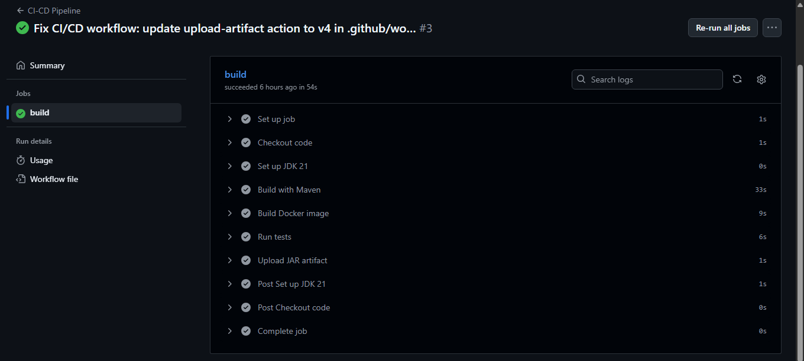
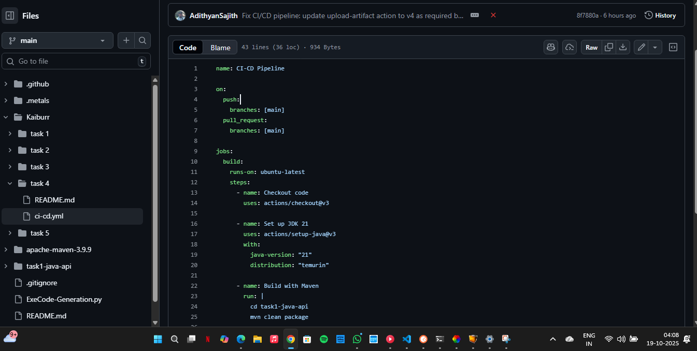

# Task 4: CI-CD Pipeline for Kaiburr Task Management App

## 📸 Screenshots

Below are screenshots demonstrating the CI/CD pipeline configuration and execution, with name and date/time visible:


*GitHub Actions workflow YAML configuration*


*Pipeline run/execution status in GitHub Actions*

This folder contains the CI/CD pipeline setup for Task 4.

## What’s Included

- **GitHub Actions workflow** for automated build and Docker image creation
- **README** with instructions and pipeline details

## Pipeline Overview

- **Code Build:** Compiles the backend using Maven
- **Docker Build:** Builds a Docker image from the backend Dockerfile
- **Test:** Runs unit tests
- **Artifact Upload:** Uploads the built JAR file as a workflow artifact

## Workflow File Location

The workflow file is located at:

```
Kaiburr/task 4/ci-cd.yml
```

## How It Works

1. **Checkout code**
2. **Set up JDK 21**
3. **Build with Maven**
4. **Build Docker image**
5. **Run tests**
6. **Upload JAR artifact**

## Example Workflow Status Badge

```

```

## How to Submit

- Push your code to GitHub
- Share your repository link (e.g., https://github.com/AdithyanSajith/Kaiburr)
- The pipeline will run automatically and show results in the Actions tab

---

For deployment or Docker publishing, contact your instructor or add steps to the workflow as needed.
